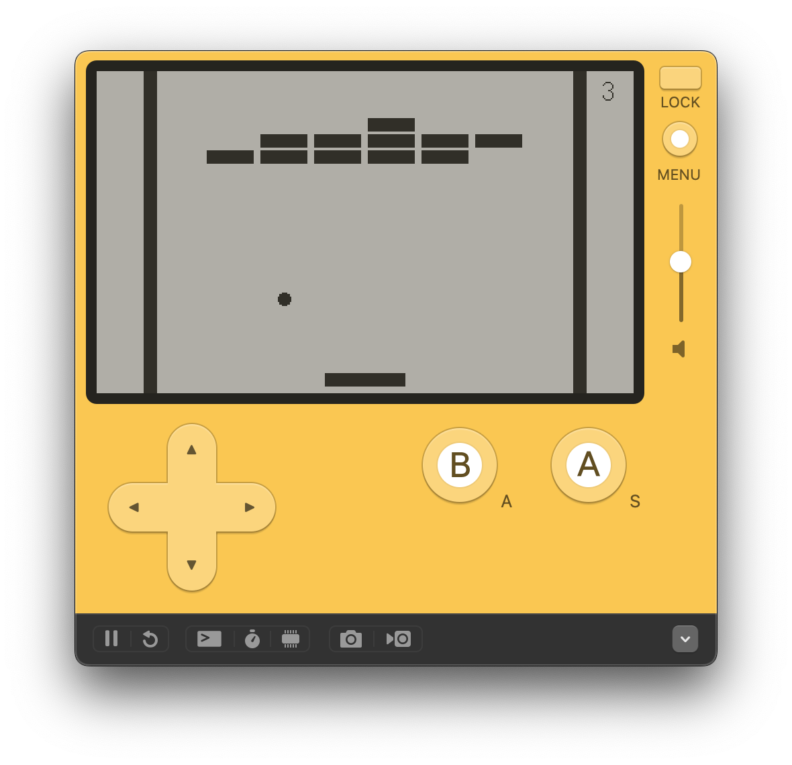

# Playdate Breakout

Inspired by the [YouTube playlist Pico-8 Tutorial - Breakout](https://www.youtube.com/playlist?list=PLea8cjCua_P0qjjiG8G5FBgqwpqMU7rBk). The git history is roughly 1 commit per main step. I stopped at video 11 and used sprites.

## Requirements
- [Node](https://nodejs.org/)
- [Playdate SDK](https://play.date/dev/)

## Get Started using VS Code
1. In VS Code, choose Run > Run Without Debugging to launch the project in the Playdate simulator.
2. Assign a keyboard shortcut to the Run Without Debugging option to build and run with a keypress.

## Output
Build files get output to `bin/Output.pdx`.
Change this by editing the `playdate.output` property in `.vscode/settings.json`.
